# AccountingHub

> A modern, cloud-based accounting and invoicing platform built for small and medium-sized businesses.

AccountingHub is an open-source web application inspired by leading accounting platforms such as **Visma e-conomic**, **Xero**, **QuickBooks Online**, **FreshBooks**, **Wave**, **Zoho Books**, **Sage Business Cloud**, **Holded**, **InvoiceXpress**, **Moloni**, and **PHC Go** — combining their best ideas into a single, warm, and approachable product built with modern technologies.

---

## Demo

https://github.com/jovbcorreia/accountinghub/raw/main/screenshots/demo.mov

---

## Screenshots

<table>
  <tr>
    <td><strong>Login</strong><br/></td>
    <td><strong>Dashboard</strong><br/>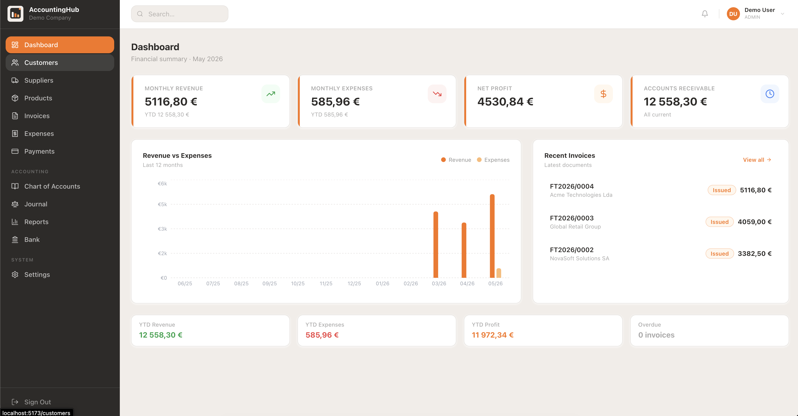</td>
  </tr>
  <tr>
    <td><strong>Invoices</strong><br/>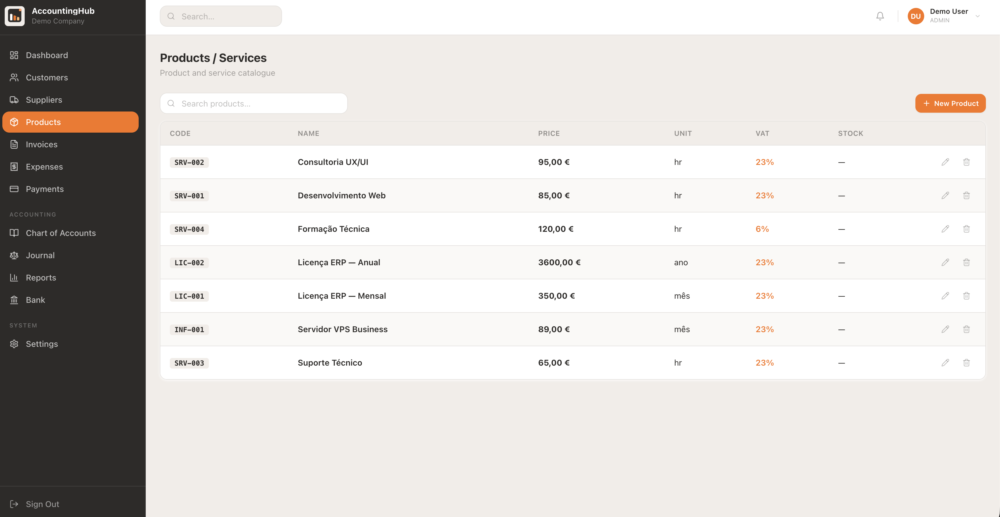</td>
    <td><strong>Payments</strong><br/>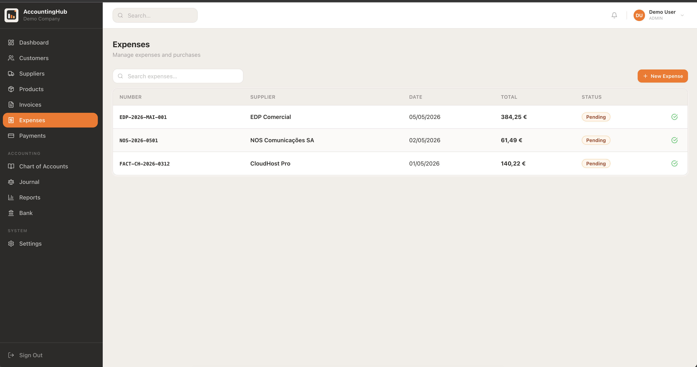</td>
  </tr>
  <tr>
    <td><strong>Customers</strong><br/>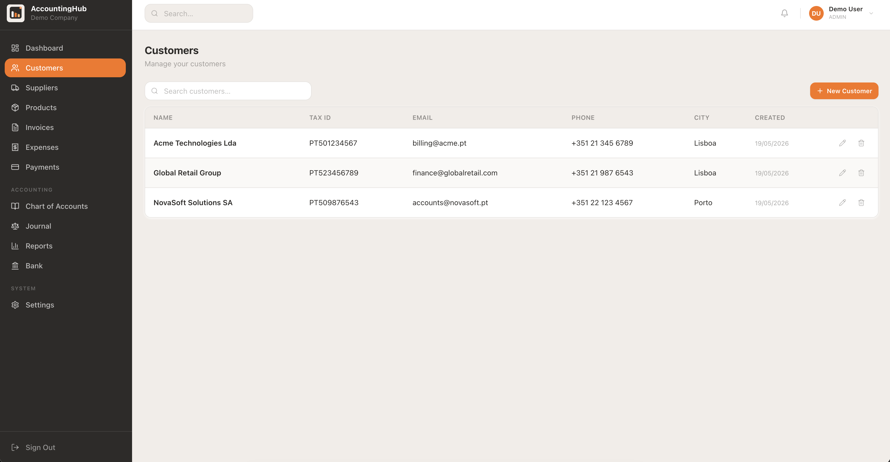</td>
    <td><strong>Suppliers</strong><br/>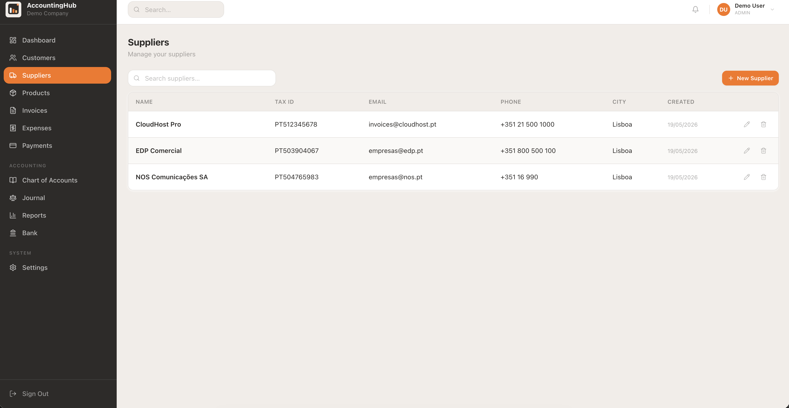</td>
  </tr>
  <tr>
    <td><strong>Products / Services</strong><br/>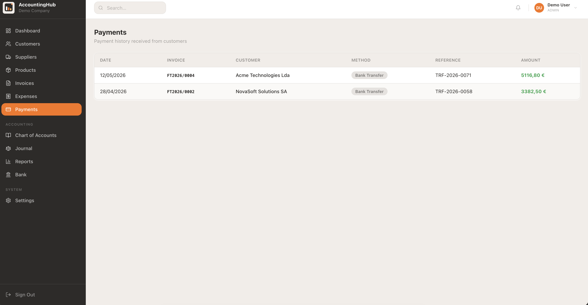</td>
    <td><strong>Expenses</strong><br/>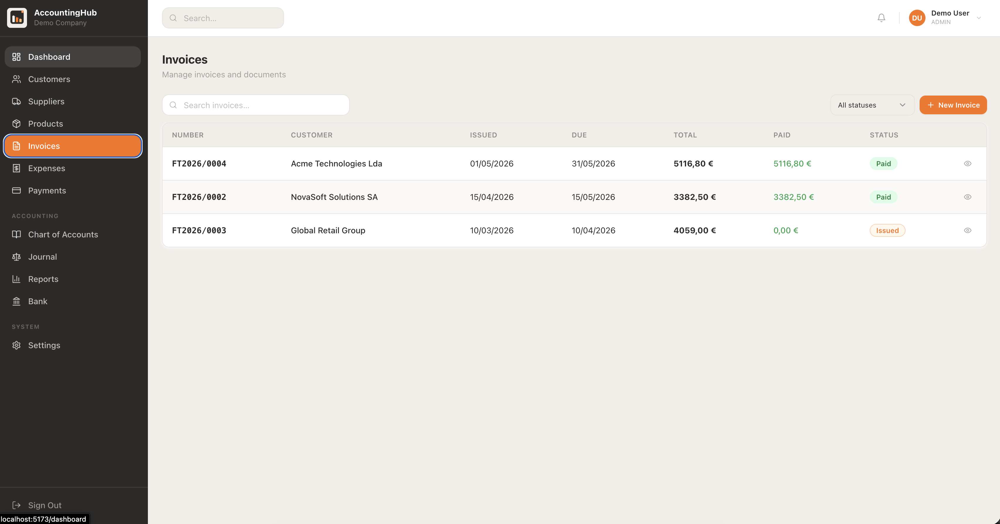</td>
  </tr>
  <tr>
    <td><strong>Journal</strong><br/>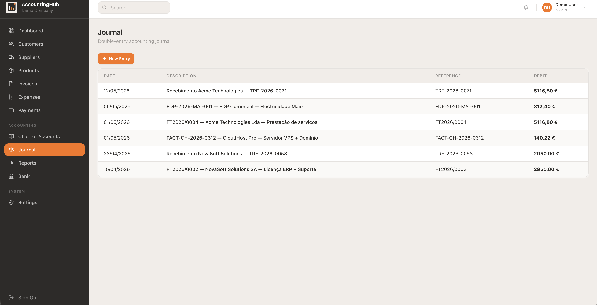</td>
    <td><strong>Reports (P&amp;L)</strong><br/>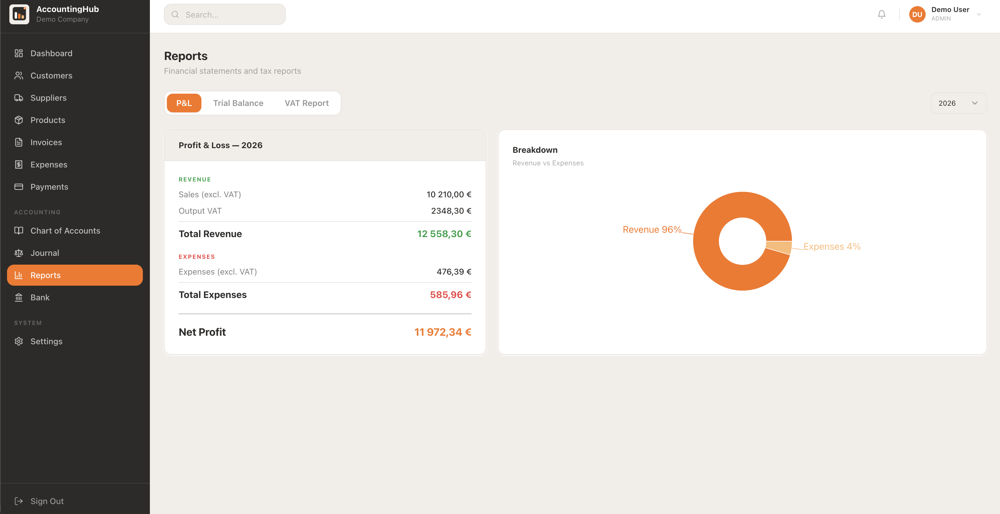</td>
  </tr>
  <tr>
    <td><strong>Bank</strong><br/>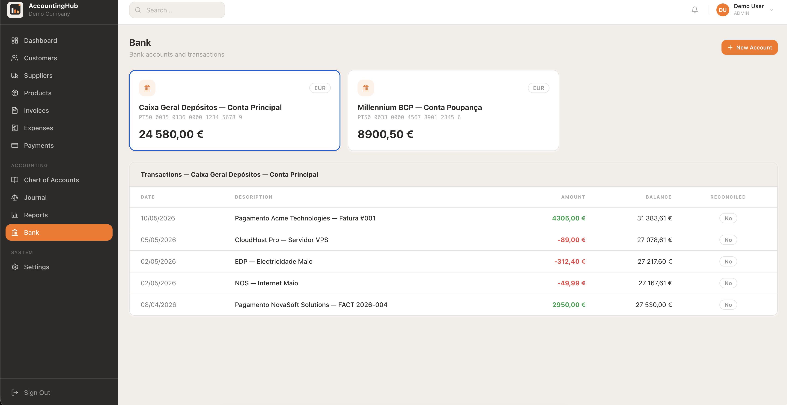</td>
    <td><strong>Settings</strong><br/>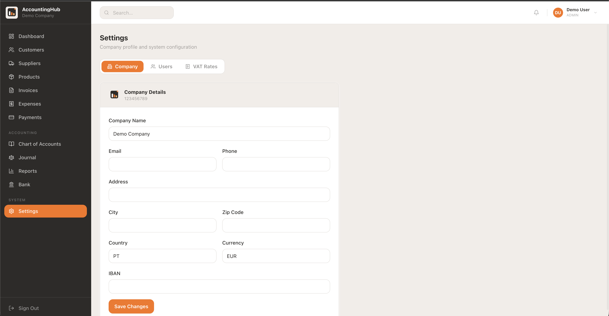</td>
  </tr>
</table>

---

## Getting Started

### Prerequisites
- Node.js 20+
- Docker Desktop **or** PostgreSQL 15 installed locally
- npm

### 1 — Clone the repository
```bash
git clone https://github.com/jovbcorreia/accountinghub.git
cd accountinghub
```

### 2 — Configure environment variables
```bash
cp .env.example backend/.env
```
Open `backend/.env` and fill in:
```env
DATABASE_URL=postgresql://YOUR_USER@localhost:5432/accountinghub
JWT_SECRET=generate_a_long_random_string
JWT_REFRESH_SECRET=generate_another_long_random_string
```

### 3 — Start the database

**Option A — Docker:**
```bash
docker compose up -d postgres
```

**Option B — Homebrew (macOS):**
```bash
brew install postgresql@15
brew services start postgresql@15
createdb accountinghub
```

### 4 — Install dependencies and run migrations
```bash
# Backend
cd backend
npm install
npx prisma migrate dev
cd ..

# Frontend
cd frontend
npm install
cd ..
```

### 5 — Start the development servers
```bash
# Terminal 1 — Backend (port 3000)
cd backend && npm run dev

# Terminal 2 — Frontend (port 5173)
cd frontend && npm run dev
```

Open [http://localhost:5173](http://localhost:5173) and register your company.

---

## Tech Stack

### Frontend
| Technology | Purpose |
|---|---|
| **React 18** | UI framework |
| **TypeScript** | Static typing |
| **Vite** | Build tool and dev server |
| **Tailwind CSS** | Utility-first styling |
| **shadcn/ui** (Radix UI) | Accessible component primitives |
| **react-hook-form** | Form state management |
| **Zod** | Schema validation |
| **Recharts** | Data visualisation (bar charts, pie charts) |
| **Zustand** | Global state management |
| **Axios** | HTTP client with interceptors |
| **React Router v6** | Client-side routing |
| **Lucide React** | Icon library |

### Backend
| Technology | Purpose |
|---|---|
| **Node.js** | Runtime |
| **Express** | HTTP framework |
| **TypeScript** | Static typing |
| **Prisma ORM** | Type-safe database access |
| **PostgreSQL 15** | Primary database |
| **bcryptjs** | Password hashing |
| **jsonwebtoken** | JWT authentication |
| **Nodemailer** | Email delivery |
| **Puppeteer** | PDF generation |
| **Zod** | Request validation |

### Infrastructure
| Technology | Purpose |
|---|---|
| **Docker & Docker Compose** | Containerisation |
| **PostgreSQL 15** (Docker) | Database container |
| **pgAdmin 4** (Docker) | Database UI (port 5050) |

---

## Features

### 💼 Business Management
- **Customers** — full customer directory with invoice history and open balance
- **Suppliers** — supplier directory linked to expenses
- **Products & Services** — catalogue with VAT rates, units, categories and stock

### 🧾 Invoicing & Documents
- **Invoices** — create Invoices, Quotes, Pro-Formas and Credit Notes
- **Sequential document numbering** — automatic, immutable, per-series (e.g. `FT2026/0001`)
- **Status workflow** — Draft → Issued → Partially Paid → Paid / Overdue → Cancelled
- **Real-time line item calculation** — subtotals, VAT per rate, discount support
- **Payment registration** — Bank Transfer, Card, Cash, MBWay, Check

### 💸 Expenses
- Supplier purchase registration with VAT line breakdown
- Status tracking: Pending → Paid → Cancelled
- One-click mark-as-paid

### 📊 Accounting
- **Chart of Accounts** — SNC (Portuguese Accounting Standards) import with one click
- **Journal** — double-entry bookkeeping with balance validation
- **Bank accounts** — multi-account management with transaction tracking

### 📈 Reports
- **Profit & Loss** — revenue vs expenses with breakdown chart
- **Trial Balance** — debit/credit balance per account with balanced check
- **VAT Report** — output vs input VAT by rate, quarterly or annual, with payable amount

### 🔐 Authentication & Multi-tenancy
- JWT + refresh tokens stored in httpOnly cookies
- Every company's data is fully isolated (multi-tenant)
- Role-based access: **Admin**, **Accountant**, **Viewer**
- Register a new company in seconds

### 🎨 Design
- Warm, modern UI — charcoal + orange + cream palette
- Sidebar navigation with grouped sections
- Responsive data tables with search, sort, pagination and row hover
- Status badges, toast notifications, confirmation dialogs

---

## Project Structure

```
accountinghub/
├── .env.example
├── .gitignore
├── docker-compose.yml
├── README.md
│
├── frontend/                 ← React + TypeScript + Vite
│   ├── public/
│   │   └── logo.svg
│   └── src/
│       ├── components/
│       │   ├── layout/       (Sidebar, Header, AppLayout)
│       │   ├── shared/       (DataTable, Toaster)
│       │   └── ui/           (Button, Badge, Card, Input, Dialog…)
│       ├── pages/
│       │   ├── Auth/         (Login, Register)
│       │   ├── Dashboard/
│       │   ├── Customers/
│       │   ├── Suppliers/
│       │   ├── Products/
│       │   ├── Invoices/     (list, create, detail)
│       │   ├── Expenses/
│       │   ├── Payments/
│       │   ├── Accounts/
│       │   ├── Journal/
│       │   ├── Reports/
│       │   ├── Bank/
│       │   └── Settings/
│       ├── services/         (API layer)
│       ├── store/            (Zustand — auth, theme)
│       ├── hooks/
│       ├── lib/
│       └── types/
│
└── backend/                  ← Node.js + Express + Prisma
    ├── prisma/
    │   ├── schema.prisma
    │   └── migrations/
    └── src/
        ├── app.ts
        ├── server.ts
        ├── middleware/       (auth, errorHandler)
        └── modules/
            ├── auth/
            ├── companies/
            ├── users/
            ├── customers/
            ├── suppliers/
            ├── products/
            ├── invoices/
            ├── payments/
            ├── expenses/
            ├── accounts/
            ├── journal/
            ├── reports/
            └── bank/
```

---

## Roadmap

- [ ] PDF invoice generation (Puppeteer)
- [ ] Email delivery of invoices (Nodemailer)
- [ ] CSV / OFX bank statement import for reconciliation
- [ ] Excel export for reports
- [ ] Company logo upload
- [ ] Dark mode
- [ ] Multi-currency support
- [ ] AT (Autoridade Tributária) SAFT-PT export

---

## LICENSE

COPYRIGHT © 2026 JOÃO VILAS-BOAS CORREIA (joaopns3@gmail.com). ALL RIGHTS RESERVED.

THIS SOFTWARE AND ITS SOURCE CODE ARE THE EXCLUSIVE INTELLECTUAL PROPERTY OF THE AUTHOR. NO PART OF THIS SOFTWARE, INCLUDING BUT NOT LIMITED TO ITS SOURCE CODE, DESIGN, ARCHITECTURE, DOCUMENTATION, AND ASSOCIATED FILES, MAY BE REPRODUCED, COPIED, MODIFIED, MERGED, DISTRIBUTED, SUBLICENSED, OR SOLD — IN WHOLE OR IN PART — WITHOUT THE PRIOR WRITTEN PERMISSION OF THE COPYRIGHT HOLDER.

COMMERCIAL USE, RESALE, OR EXPLOITATION OF THIS SOFTWARE OR ANY DERIVATIVE WORK FOR PROFIT IS STRICTLY PROHIBITED.

THIS SOFTWARE IS PROVIDED "AS IS", WITHOUT WARRANTY OF ANY KIND, EXPRESS OR IMPLIED, INCLUDING BUT NOT LIMITED TO THE WARRANTIES OF MERCHANTABILITY, FITNESS FOR A PARTICULAR PURPOSE AND NON-INFRINGEMENT. IN NO EVENT SHALL THE AUTHOR BE LIABLE FOR ANY CLAIM, DAMAGES OR OTHER LIABILITY ARISING FROM, OUT OF OR IN CONNECTION WITH THE SOFTWARE OR THE USE OR OTHER DEALINGS IN THE SOFTWARE.

FOR LICENSING ENQUIRIES, CONTACT joaopns3@gmail.com.
